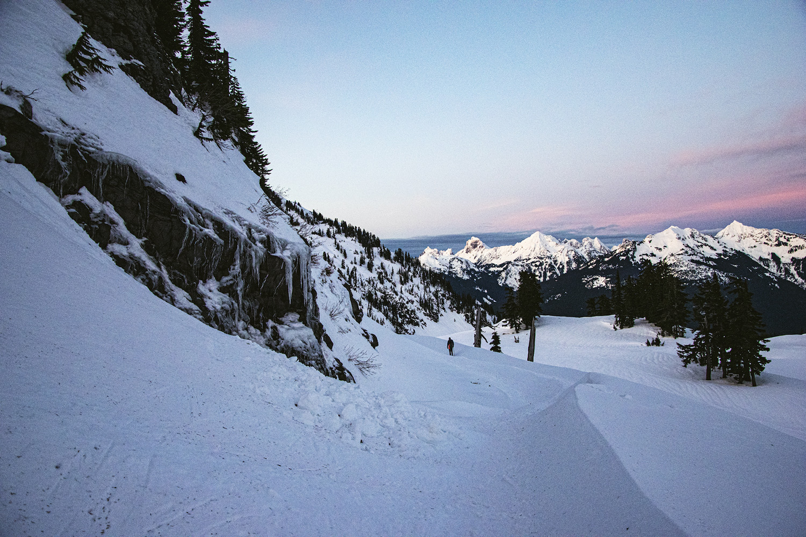

## RECAP VIDEO
<iframe width="560" height="315" src="https://www.youtube.com/embed/lnqtSLdwHoA" frameborder="0" allow="accelerometer; autoplay; clipboard-write; encrypted-media; gyroscope; picture-in-picture" allowfullscreen></iframe>

## TRAIL REPORT
ALWAYS check https://nwac.us/​ for avalanche danger in the area. This area is prone to avalanches and unless you have proper training and gear for handling them, I'd avoid going if there is any risk.

It's a 3 hour drive from Seattle and the parking lot fills up pretty quickly. There was plenty of space mid-week, but if going during the weekend I'd plan to go very early and even prepare a few back-up hikes that are along the drive. I also recommend stopping in Glacier for a final bathroom break and getting breakfast/coffee at Wake'n Bakery.

Find the start of the trail by heading to the bathrooms, to the left is the groomed ski run. From there stay to the right of the ski run (not on it) and go up that way. It's best to have a map since not all tracks in the snow go up to artist point. AllTrails worked well for me.

The way up is pretty steep, so getting proper snowshoes that handle incline is recommended (REI rents out nice ones).  I also recommend bringing something to sit on. It's a super short trail and there's so much to see that hanging out at the top for a bit is a nice way to extend the experience!

You can make the trip longer but going up to Huntoon Point. I wanted to, but no one else was and I didn't feel comfortable doing it alone, so it's not covered in this video. The route is on the AllTrails map if you're up for it!

Covid-times advice: You don't have to stick to one path, so this is perfect for keeping distance from others! It's really easy to spread out, but still have a mask for when you are lingering around the parking lot and such.

If going for sunset, having a bright light/headlamp and a map is essential. Navigating down is going to be a lot harder, and there's going to be less/no people to follow. It's super easy to get lost since it's a lot of snowfields that look the same. Only do it if you're comfortable with navigation.

## PHOTOS

## ADDITIONAL LINKS
- <a href="https://www.alltrails.com/explore/recording/upper-lodge-to-artist-point-trail-de594ef" alt="My AllTrails Recording" target="_blank">My AllTrails Recording</a>
- <a href="https://www.alltrails.com/explore/trail/us/washington/upper-lodge-to-artist-point-trail" alt="AllTrails trail info" target="_blank">AllTrails Trail Info</a>
- <a href="https://www.wta.org/go-hiking/hikes/artist-point-snowshoe" alt="Washington Trails Association Guide" target="_blank">Washington Trails Association Guide</a>
