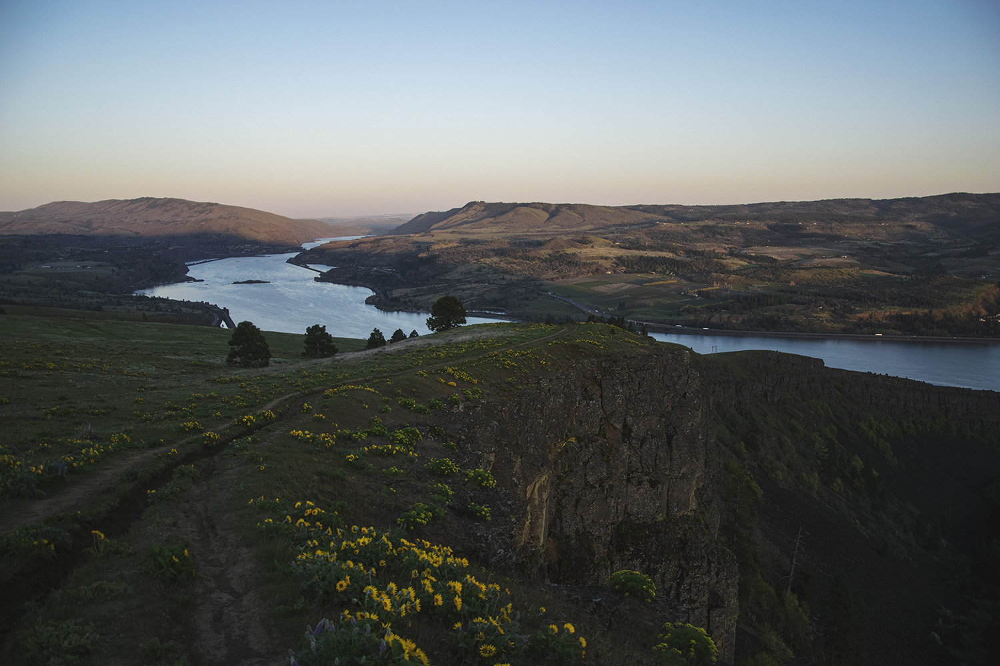
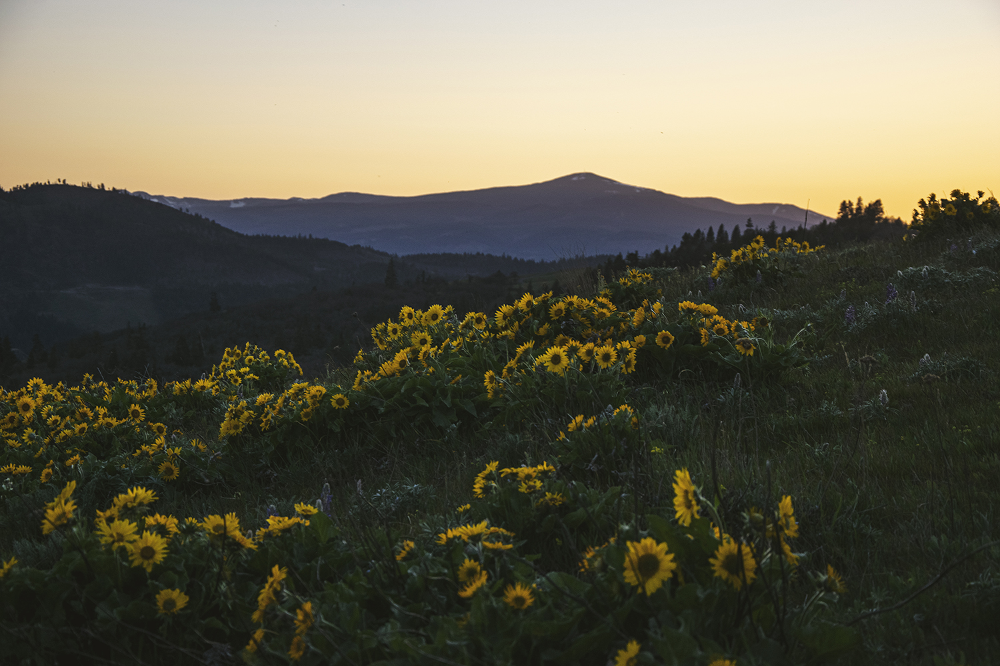

## RECAP VIDEO
<iframe width="560" height="315" src="https://www.youtube.com/embed/aWPom7P2TnM" title="YouTube video player" frameborder="0" allow="accelerometer; autoplay; clipboard-write; encrypted-media; gyroscope; picture-in-picture" allowfullscreen></iframe>

## TRAIL REPORT
It. Was. Hot. And it was only in the 70's while I was there. I'm pretty sensitive to heat, but still, it's a pretty brutal climb with the sun beating on you on the clear days.

The trail is part of a network of trails, so there are several options to get to the top, the Alltrails map was handy to making sure I was taking my intended route (it can be downloaded to your phone with their app).  I did a loop where I went up along the eastern side and went down the western side. That way I'd have the best view for the sunset!

It is steep, but not the worst. There are spots where the dirt/rocks/gravel were pretty loose, so it can be slippery going down. Definitely have shoes with good traction, most hiking-specific shoes are fine.

Be warned, there are also lots of ticks! They didn't bother me, but they loved my very fluffy dog. I was picking them off for a couple of days after the hike. I also saw a snake, it likely was a harmless, nonvenomous one. But there are rattlesnakes in the area, so just be cautious of your surroundings!

This trail gets SUPER busy, so if you're wanting more solidtude its best to go mid-week. Or you can do a sunrise or sunset hike and have even more of the trail to yourself!  Just be sure to have headlamps and something nice to drink :)

## PHOTOS

## ADDITIONAL LINKS
- <a href="https://www.fs.usda.gov/recarea/crgnsa/recarea/?recid=78498" alt="National Forest Trail Info" target="_blank">Forest Service Trail Info</a>
- <a href="https://www.alltrails.com/explore/recording/coyote-wall-loop-trail-1fd09c5" alt="My AllTrails Recording" target="_blank">My AllTrails Recording</a>
- <a href="https://www.alltrails.com/trail/us/washington/coyote-wall-loop-trail" alt="AllTrails trail info" target="_blank">AllTrails Trail Info</a>
- <a href="https://www.wta.org/go-hiking/hikes/catherine-creek-the-labyrinth" alt="Washington Trails Association Guide" target="_blank">Washington Trails Association Guide</a>
