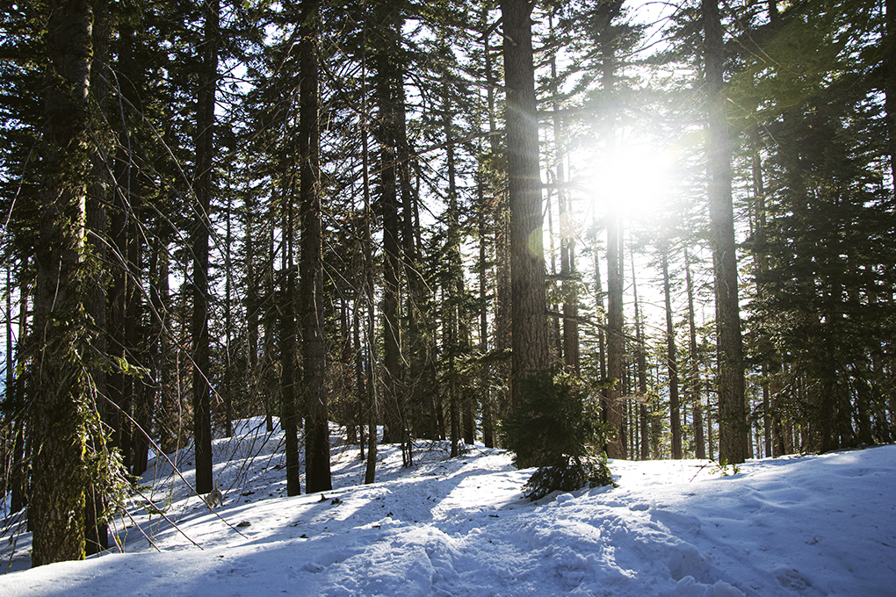
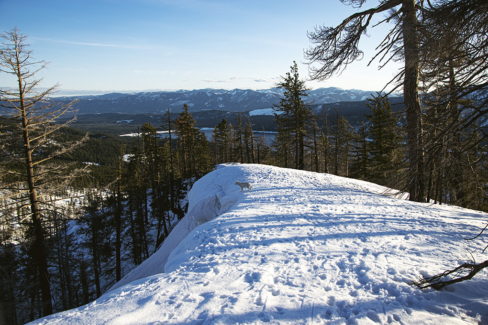
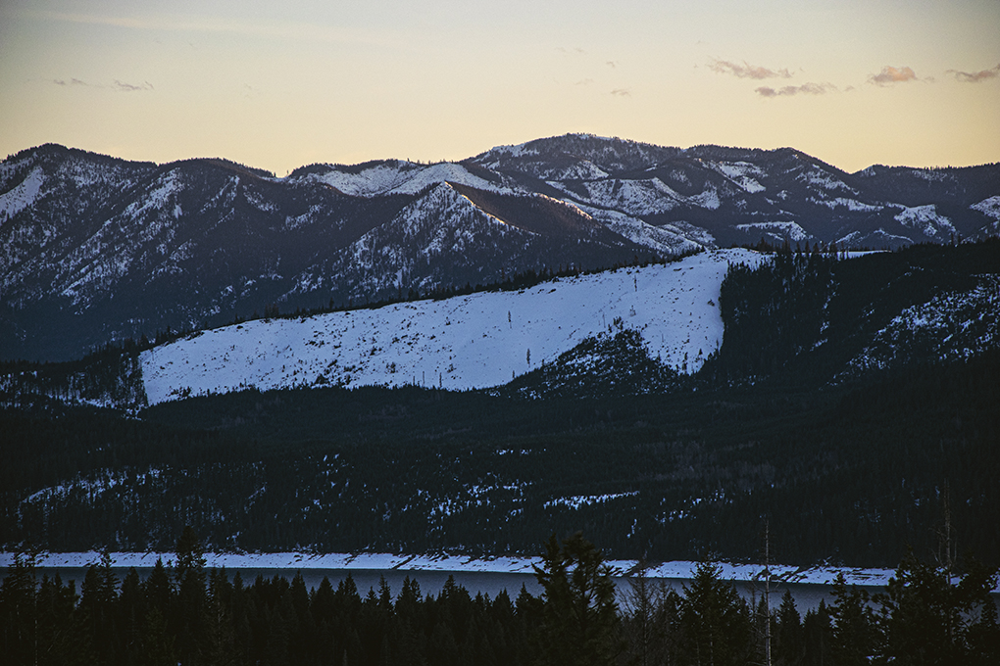

## RECAP VIDEO
<iframe width="560" height="315" src="https://www.youtube.com/embed/4Un4G0WzLCo" title="YouTube video player" frameborder="0" allow="accelerometer; autoplay; clipboard-write; encrypted-media; gyroscope; picture-in-picture" allowfullscreen></iframe>

## TRAIL REPORT
I highly recommend doing this trail later in the season for a few reasons - longer days means more times to tackle the miles and incline, you can avoid encountering snowmobiles and inhaling their exhaust (which are allowed on the trail),  the snow might be hard enough to need only spikes (but carrying snowshoes is still a good idea), AND there's a better chance of encountering blue-bird clear skies that will give you the incredible view.

I did this trail in January 2020 and had a much different experience with no views, early sunset, snowmobile noise and exhaust, and wet, unpleasant snow.  Of course, it's not always going to be that way, but this time around (in March) was dramatically different!

This is a great winter option if you're wanting something to condition you for harder hikes in summer. There is nearly no avalanche risk as long as you stick to the trail, which is already a huge perk for a snow hike with elevation! And there are opportunities to add more miles if you like (check out the maps on alltrails.com, link below).

The ridgeline (starting at the trail marker, ~1.8 miles in) and the summit are incredibly and truly worth the effort of the steep incline. There's plenty of opportunities to take breaks along the way, just be sure to mindful of limited winter daylight.

If going with snowshoes, make sure to bring ones that are suited for mountain terrain (have traction and made for incline, MSR is a top-choice). Here's an exhaustive article explaining the different types: https://www.backcountry.com/explore/how-to-choose-snowshoes

## PHOTOS

## ADDITIONAL LINKS
- <a href="https://www.fs.usda.gov/recarea/crgnsa/recarea/?recid=78498" alt="National Forest Trail Info" target="_blank">Forest Service Trail Info</a>
- <a href="https://www.alltrails.com/explore/recording/hex-mountain-trail-eff7451" alt="My AllTrails Recording" target="_blank">My AllTrails Recording</a>
- <a href="https://www.alltrails.com/explore/trail/us/washington/hex-mountain-trail" alt="AllTrails trail info" target="_blank">AllTrails Trail Info</a>
